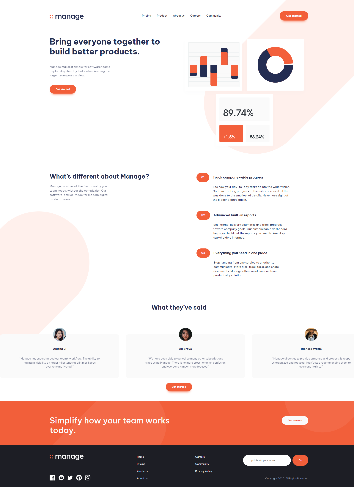
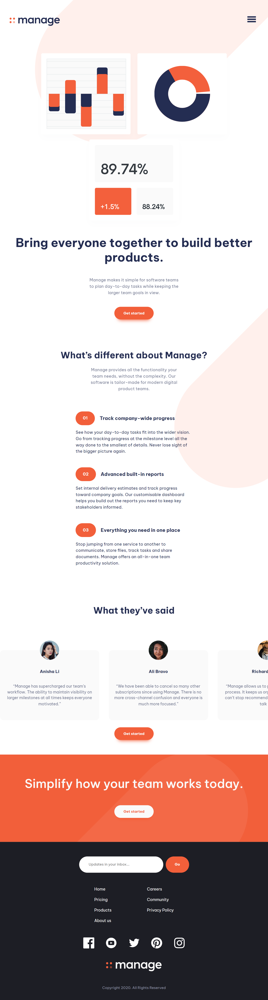
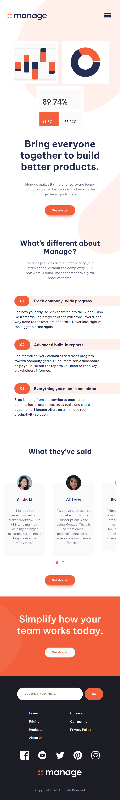
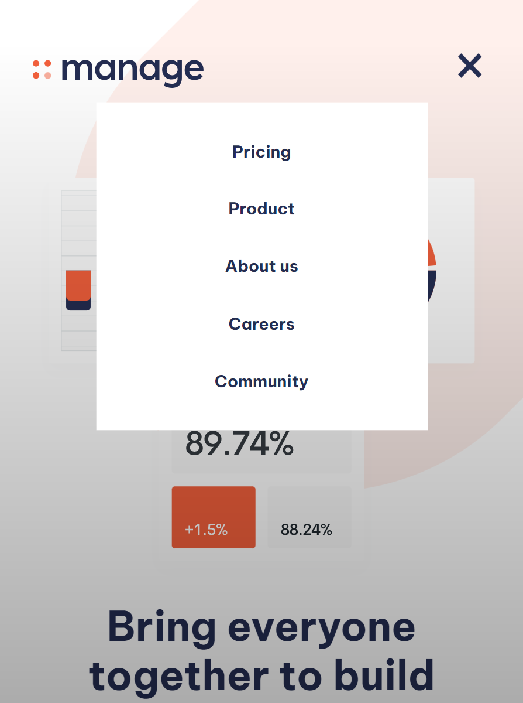

# Responsive landing page layout
## Description
### Technologies used
It is a responive layout made with `html`, `css`, `scss` and bundled with `webpack`. 

To make the layout responsive I've used `grid`'s, `flex`'s, `@media` queries.
### Customization
To make it adjustable I have all the custom variables that define colors, font-size, font-weight and other parameters collected in the `_variables.scss` partial.

I have used utility classes collected in the `_utilityClasses.scss` partial to make it even more customizable. 
### JS
#### Hamburger menu
Using `Javascript` I have implemented a simple hamburger menu for the mobile layout. 
#### Slider
I also have implemented the `A11Y` slider for the carousel.
### Original figma desgin
The original design link - https://www.frontendmentor.io/challenges/manage-landing-page-SLXqC6P5
## Intro (layout screenshots)

 Desktop layout

 

Active states

 

Tablet layout

 

Mobile layout

 

Active menu on mobile

 

